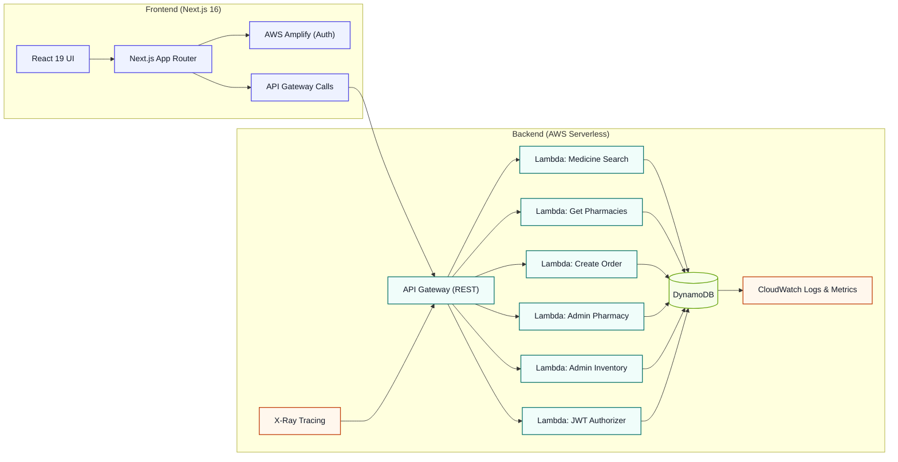
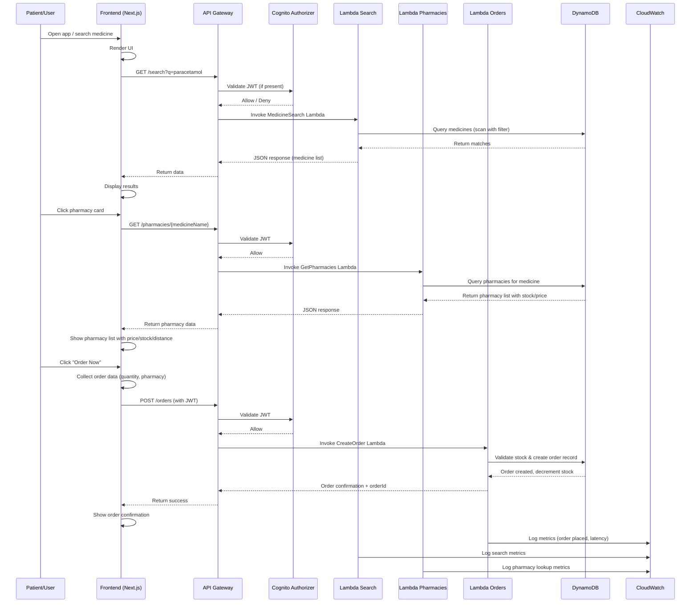

# 🏥 MediFind - Modern Medicine Finder

> A production-ready application for finding medicines at nearby pharmacies, built with **AWS serverless** technologies and **Next.js 16 (App Router)**.

[](https://opensource.org/licenses/MIT)
[](https://nextjs.org/)
[](https://reactjs.org/)
[](https://aws.amazon.com/lambda/)
[](https://aws.amazon.com/dynamodb/)
[](https://aws.amazon.com/api-gateway/)
[](https://aws.amazon.com/cognito/)
[](https://github.com/s-aduk/MediFind/actions)

---

## 📖 Table of Contents

- [Overview](#overview)
- [Architecture Diagram](#architecture-diagram)
- [Data Flow Diagram](#data-flow-diagram)
- [✨ Features](#features)
- [🛠️ Tech Stack](#tech-stack)
- [🚀 Getting Started](#getting-started)
  - [Prerequisites](#prerequisites)
  - [Installation](#installation)
  - [Environment Configuration](#environment-configuration)
  - [Running Locally](#running-locally)
  - [Deployment](#deployment)
- [📂 Project Structure](#project-structure)
- [🔌 API Endpoints](#api-endpoints)
- [🧪 Testing](#testing)
- [📜 License](#license)
- [🤝 Contributing](#contributing)
- [🙏 Acknowledgements](#acknowledgements)

---

## Overview

MediFind connects patients with nearby pharmacies that have specific medications in stock. Users can search for medicines, compare prices and availability, view pharmacy details, and place orders—all through a clean, responsive interface backed by a fully managed AWS serverless backend.

## Architecture Diagram



*Diagram shows data flow from the Next.js frontend through API Gateway to Lambda functions that interact with DynamoDB. Observability is provided by CloudWatch and AWS X-Ray.*

## Data Flow Diagram



*Sequence diagram illustrates a typical user flow: searching a medicine, viewing pharmacy options, and placing an order, with authentication, Lambda invocations, DynamoDB interactions, and observability.*

---

## ✨ Features

| Feature | Description |
|---------|-------------|
| **🔍 Medicine Search** | Instant search by name (case-insensitive, partial match) with relevance ranking. |
| **🏥 Pharmacy Listings** | See which nearby pharmacies have the medicine in stock, with distance, price, and inventory. |
| **💊 Price & Availability** | Real-time pricing and stock levels; out-of-stock items clearly marked. |
| **🧾 Order Management** | Place orders, specify quantity, choose pharmacy, receive confirmation & tracking. |
| **🔐 Secure Authentication** | Email/password via Amazon Cognito (sign-up, verification, sign-in, password reset). |
| **⚙️ Admin Panel** | CRUD for pharmacies, inventory updates, stock-level alerts, order oversight. |
| **📱 Responsive Design** | Mobile-first layout works on phones, tablets, and desktops. |
| **☁️ Serverless Backend** | Fully managed AWS Lambda, API Gateway, DynamoDB – zero-server ops. |
| **📦 Infrastructure as Code** | AWS SAM template defines all resources; reproducible deployments. |
| **🛡️ Security Best Practices** | Least-privilege IAM, input validation, CORS, XSS/CSRF protection, environment-specific config. |
| **📊 Observability** | CloudWatch Logs, Metrics, custom business KPIs, AWS X-Ray tracing. |

---

## 🛠️ Tech Stack

| Category | Technology | Version / Notes |
|----------|------------|-----------------|
| **Frontend** | Next.js (App Router) | 16.2.x |
| | React | 19.x |
| | TypeScript | Not used (JavaScript with JSDoc) |
| | Styling | CSS Modules + CSS Custom Properties (design tokens) |
| | UI Icons | Lucide React |
| | Auth | AWS Amplify (Cognito) |
| **Backend** | AWS Lambda (Node.js) | 22.x runtime |
| | API Gateway | REST API |
| | Data Store | Amazon DynamoDB (single-table design) |
| | Auth | Amazon Cognito User Pools + JWT Authorizer |
| | Infrastructure | AWS SAM (CloudFormation) |
| | Dependencies | AWS SDK v3, Middy (middleware), Joi (validation) |
| **DevOps** | GitHub Actions | CI/CD (build, test, deploy) |
| | AWS CLI / SAM CLI | Local testing & deployment |
| | Docker | Local Lambda simulation |
| | Testing | Jest (backend), Jest + React Testing Library (frontend) |
| | Linting | ESLint (with `eslint-config-next`) |
| | Formatting | Prettier |
| **Monitoring** | CloudWatch Logs & Metrics | – |
| | AWS X-Ray | Distributed tracing |
| | Custom Dashboards | CloudWatch (optional) |

---

## 🚀 Getting Started

### Prerequisites

- **Node.js** ≥ 18.x
- **Python** ≥ 3.9 (for `seed_data.py`)
- **AWS CLI** v2 (configured with an IAM user that has `AdministratorAccess` or a scoped policy)
- **AWS SAM CLI**
- **Docker** (to run Lambda locally)
- **Git**
- Optional: **Postman** or **curl** for API testing

### Installation

1. **Clone the repository**
   ```bash
   git clone https://github.com/s-aduk/MediFind.git
   cd MediFind
   ```

2. **Backend setup**
   ```bash
   cd backend
   npm ci               # install Node.js dependencies
   # (if you prefer a Python venv for the seed script)
   # python -m venv .venv && source .venv/bin/activate
   # pip install boto3   # if requirements.txt exists
   ```

3. **Frontend setup**
   ```bash
   cd ../frontend
   npm ci
   ```

4. **Environment configuration**
   ```bash
   # From the project root
   cp .env.example .env.local   # frontend
   cp .env.example .env         # backend (shared)
   # Edit the .env files with your local values, e.g.:
   #   NEXT_PUBLIC_API_URL=http://localhost:3000/dev
   #   AWS_PROFILE=mydevprofile
   #   AWS_REGION=us-east-1
   ```

### Running Locally

#### Start the frontend dev server
```bash
cd frontend
npm run dev   # → http://localhost:3000
```

#### Test Lambda functions locally (in another terminal)
```bash
cd backend
# Example: invoke the medicine search function
sam local invoke MedicineSearchFunction -e events/event.json

# Or start the API locally:
sam local start-api
```

### Deployment

Full, step-by-step procedures are in the `docs/runbooks/` folder:

1. **[Deploy to Staging](docs/runbooks/01-deploy-to-staging.md)**
2. **[Deploy to Production](docs/runbooks/02-deploy-to-production.md)**
3. **[Database Seeding](docs/runbooks/04-database-seeding.md)**
4. **[Rollback Procedure](docs/runbooks/03-rollback-procedure.md)**

#### Quick deployment overview (staging)

```bash
# 1. Build SAM application
sam build

# 2. Deploy (guided first time)
sam deploy --guided \
  --stack-name medifind-staging \
  --region us-east-1 \
  --capabilities CAPABILITY_IAM CAPABILITY_AUTO_EXPAND \
  --parameter-overrides Environment=staging

# 3. Get outputs (API URL, Cognito Pool ID, etc.)
sam list-stack-outputs --stack-name medifind-staging

# 4. Seed the database
cd backend
python seed_data.py   # reads credentials from ~/.aws or env vars
```

> **Tip**: Use separate AWS profiles (`export AWS_PROFILE=staging` / `prod`) or environment variables to avoid mixing accounts.

---

## 📂 Project Structure

```
MediFind/
├── backend/                     # Lambda functions (Node.js 22.x)
│   ├── src/
│   │   └── functions/
│   │       ├── medicine-search/   # GET /search?q=<query>
│   │       ├── get-pharmacies/    # GET /pharmacies/{medicineName}
│   │       ├── create-order/      # POST /orders
│   │       ├── admin-inventory/   # CRUD /admin/inventory
│   │       ├── admin-pharmacy/    # CRUD /admin/pharmacies
│   │       └── jwt-authorizer/    # Cognito JWT validation
│   ├── package.json
│   ├── jest.config.js
│   ├── babel.config.js
│   └── seed_data.py             # populates DynamoDB with sample data
├── frontend/                    # Next.js 16 application
│   ├── src/
│   │   ├── app/                 # App Router pages & layouts
│   │   │   ├── page.js          # Landing page
│   │   │   ├── layout.js        # Root layout
│   │   │   ├── globals.css      # Design tokens + global styles
│   │   │   ├── search/
│   │   │   │   └── page.js      # Search & pharmacy results
│   │   │   └── login/
│   │   │       └── page.js      # Login / Sign-up page
│   │   ├── components/          # Reusable UI pieces
│   │   │   ├── SearchMedicine.js
│   │   │   ├── PharmaciesList.js
│   │   │   └── Login.js
│   │   └── lib/                 # API service, auth helpers
│   │       ├── api.js
│   │       └── auth.js
│   ├── next.config.mjs
│   ├── eslint.config.mjs
│   ├── package.json
│   └── README.md                # Frontend-specific notes
├── infrastructure/              # AWS SAM template
│   └── template.yaml            # Defines all AWS resources
├── docs/
│   ├── adr/                     # Architecture Decision Records
│   │   ├── 0001-use-aws-sam-for-infrastructure.md
│   │   ├── 0002-dynamodb-single-table-design.md
│   │   ├── 0003-lambda-function-per-bounded-context.md
│   │   ├── 0004-cognito-for-authentication.md
│   │   └── 0005-nextjs-app-router.md
│   └── runbooks/                # Operational procedures
│       ├── 01-deploy-to-staging.md
│       ├── 02-deploy-to-production.md
│       ├── 03-rollback-procedure.md
│       └── 04-database-seeding.md
├── .github/
│   └─ workflows/
│       └─ deploy.yml           # GitHub Actions CI/CD
├── .env.example                # Template for environment variables
├── .gitignore
├── LICENSE                     # MIT licence
├── CONTRIBUTING.md             # Contribution guidelines
└── README.md                   # This file
```

---

## 🔌 API Endpoints

All endpoints are relative to the deployed API Gateway stage (e.g. `https://<id>.execute-api.<region>.amazonaws.com/Prod`).

| Method | Endpoint | Description | Auth |
|--------|----------|-------------|------|
| `GET`  | `/search?q=<query>` | Search medicines by name (case-insensitive, partial) | ❌ |
| `GET`  | `/pharmacies/{medicineName}` | List pharmacies that have the given medicine in stock | ❌ |
| `POST` | `/orders` | Create a new order (requires JWT) | ✅ |
| `POST` | `/admin/pharmacies` | Register a new pharmacy (admin only) | ✅ |
| `GET`  | `/admin/pharmacies` | List all pharmacies (admin) | ✅ |
| `GET`  | `/admin/pharmacies/{pharmacyId}` | Get specific pharmacy (admin) | ✅ |
| `PUT`  | `/admin/pharmacies/{pharmacyId}` | Update pharmacy (admin) | ✅ |
| `DELETE`| `/admin/pharmacies/{pharmacyId}` | Delete pharmacy (admin) | ✅ |
| `POST` | `/admin/inventory` | Create inventory record (admin) | ✅ |
| `GET`  | `/admin/inventory` | List inventory with filters (admin) | ✅ |
| `PUT`  | `/admin/inventory` | Update inventory item (admin) | ✅ |
| `DELETE`| `/admin/inventory` | Delete inventory item (admin) | ✅ |
| `GET`  | `/health` | Liveness probe (used by ALB/APIGW) | ❌ |

**Standard response envelope**

```json
{
  "success": true,
  "data": { /* payload */ },
  "error": null,
  "meta": {
    "total": 42,
    "page": 1,
    "limit": 20
  }
}
```

On error:

```json
{
  "success": false,
  "data": null,
  "error": "Human readable message",
  "meta": null
}
```

---

## 🧪 Testing

### Backend
```bash
cd backend
npm test            # runs Jest unit + integration tests
# With coverage:
npm run test:cov
```

### Frontend
```bash
cd frontend
npm test            # Jest + React Testing Library
# With coverage:
npm run test:cov
```

### Linting & Formatting
```bash
# Backend
cd backend
npm run lint
npm run lint:fix

# Frontend
cd frontend
npm run lint
# Formatting (optional):
npm run format      # uses Prettier
```

### Coverage Goal
Maintain **≥80%** statement, branch, and function coverage across unit & integration tests.

---

## 📜 License

This project is licensed under the **MIT License** – see the [`LICENSE`](LICENSE) file for details.

---

## 🤝 Contributing

We 💖 contributions! Please read our [Contributing Guidelines](CONTRIBUTING.md) for details on our code of conduct, pull-request process, and development workflow.

**Quick contribution flow**

1. Fork the repository
2. Create a feature branch: `git checkout -b feat/amazing-feature`
3. Commit your changes: `git commit -m 'feat: add amazing feature'`
4. Push to the branch: `git push origin feat/amazing-feature`
5. Open a Pull Request against `main`

Make sure your PR passes all linting and tests before requesting review.

---

## 🙏 Acknowledgements

- **[AWS Serverless Application Model (SAM)](https://aws.amazon.com/serverless/sam/)** – effortless IaC for Lambda, API Gateway, DynamoDB, and more.
- **[Next.js](https://nextjs.org/) & [React](https://reactjs.org/)** – modern React framework with server-components and incremental static regeneration.
- **[AWS Amplify](https://aws.amazon.com/amplify/)** – seamless Cognito integration for auth flows.
- **[Lucide Icons](https://lucide.dev/)** – beautiful, open-source SVG icons used throughout the UI.
- **[Shields.io](https://shields.io/)** – for the project badges you see above.
- The open-source community for countless libraries, utilities, and best-practice guides that make this project possible.

---

<div align="center">
  Made with ❤️ and ☕ by the MediFind Team<br>
  <a href="https://github.com/s-aduk/MediFind">github.com/s-aduk/MediFind</a>
</div>