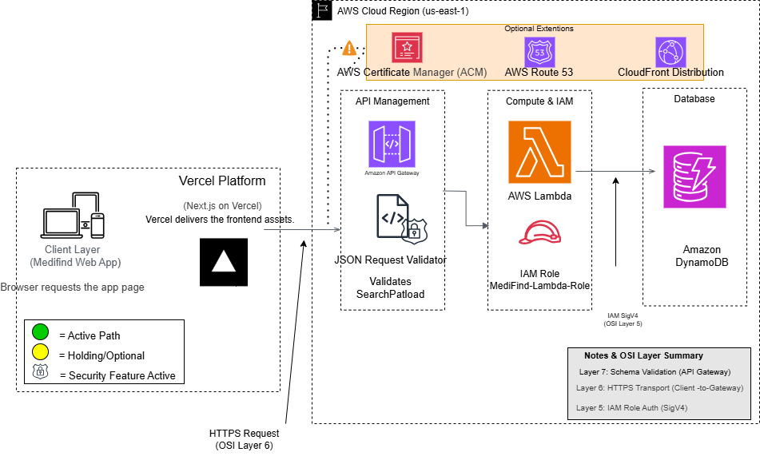

# MediFind
A cloud-native platform for finding medicines available in pharmacies across the city.


# MediFind - AWS Serverless Drug Availability Finder


A cloud-native platform for helping users find medicines available in pharmacies across the city.

## System Architecture


## Overview

**MediFind** is a cloud-based drug availability platform that helps users quickly find medicines available in nearby pharmacies.

The platform connects users with pharmacies by providing:

- Drug search functionality
- Pharmacy availability information
- Inventory management
- Pharmacy registration
- User notifications when medicines become available

The system is built using a **serverless AWS architecture** using Amazon API Gateway, AWS Lambda, DynamoDB, and AWS SAM.


## Features

- Search for medicines
- View pharmacies with available stock
- Pharmacy registration
- Inventory management
- Notification support


## Tech Stack

### Frontend
- Next.js
- React

### Backend
- AWS Lambda
- Amazon API Gateway

### Database
- Amazon DynamoDB

### Infrastructure
- AWS SAM


## Repository Structure

```text
frontend/
backend/
infra/
docs/
tests/


```markdown
## Getting Started

### Clone the repository

```bash
git clone https://github.com/denkod/MediFind.git
cd MediFind


cd frontend

## 🗄️ Database Setup & Seeding

This project uses **Amazon DynamoDB** as its database service. Follow these steps to set up and populate your local development environment with initial test data.

### Prerequisites

1. Ensure you have Python installed (`v3.8+`).
2. Make sure `boto3` is installed:
   ```bash
   pip install boto3

3. Configure your AWS credentials locally using the AWS CLI:

    ```bash
    aws configure
4. Enter your AWS Access Key ID, Secret Access Key, and set the region to `us-east-1`.

5. Seeding the Database
To populate your DynamoDB tables (Pharmacies and Inventory) with test data, run the seed script:

    ```ash
    python seed_data.py

6. Verifying the Seeded Data
To verify that the records were successfully inserted into AWS DynamoDB, run the test reader script:

    ```bash
    python test_read.py
npm install
npm run dev

cd infra
sam build
sam deploy --guided
