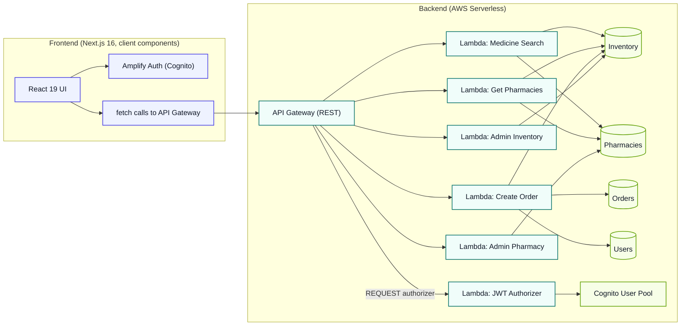

# 🏥 MediFind - Medicine Finder

> **A serverless medicine finder application connecting patients with nearby pharmacies in real-time**

[](https://opensource.org/licenses/MIT)
[](https://nextjs.org/)
[](https://reactjs.org/)
[](https://aws.amazon.com/lambda/)
[](https://aws.amazon.com/dynamodb/)
[](https://aws.amazon.com/cognito/)
[](https://aws.amazon.com/serverless/sam/)
[](https://tailwindcss.com/)
[](https://jestjs.io/)
[](https://eslint.org/)
[](CONTRIBUTING.md)
[](#)

---

## 🎯 Overview

MediFind is a **serverless full-stack application** that helps patients find medications at nearby pharmacies in real-time. Users can:

- 🔍 Search for medicines by name (partial match, case-insensitive)
- 🏥 View pharmacy availability, prices, and stock levels
- 📝 Place orders for medicines (authenticated users)
- 👨‍⚕️ Admin users can manage pharmacy inventory and pharmacy listings
- 📱 Fully responsive design for mobile and desktop

Built with **Next.js 16 (App Router)** on the frontend and a **fully serverless AWS backend** using Lambda, API Gateway, DynamoDB, and Cognito.

## 🏗️ Architecture



### 🔐 Security & Architecture Highlights
- **Fine-grained permissions**: Each Lambda function has least-privilege IAM policies
- **Secure authentication**: JWT authorizer integrated with API Gateway (no client-trusted identity)
- **Separation of concerns**: Four separate DynamoDB tables for optimal access patterns
- **Observability**: AWS X-Ray tracing, CloudWatch Logs, and structured logging with Lambda Powertools

## ✨ Features

### 🚑 Core Functionality
| Feature | Status | Description |
|---------|--------|-------------|
| 🔍 Medicine Search | ✅ Working | Partial match, case-insensitive search across all medicines |
| 🏥 Pharmacy Listings | ✅ Working | Real-time availability, pricing, and stock levels with distance calculation |
| 📝 Order Placement | ✅ Working | Authenticated orders with stock race-condition prevention |
| 🔐 User Authentication | ✅ Working | Email/password signup, verification, and sign-in via AWS Cognito |
| 👨‍⚕️ Admin Management | ✅ Working (API-only) | Pharmacy & inventory management (`custom:role = admin` required) |

### ⚠️ Known Limitations
| Feature | Status | Notes |
|---------|--------|-------|
| 🔐 Forgot/Reset Password | ❌ Not implemented | Planned enhancement |
| 🔄 Token Auto-refresh | ❌ Not implemented | Tokens expire after 1 hour (Cognito default) - requires re-login |
| 🖥️ Admin UI | ❌ Not implemented | Admin functions available via API only - no visual interface |
| 📊 Comprehensive Tests | ⚠️ Backend only | 18 Jest tests covering 3/6 Lambda functions; no frontend tests yet |
| 🔄 CI/CD Pipeline | ❌ Not configured | Manual deployment via SAM CLI currently |

### 📱 Technical Excellence
| Feature | Status |
|---------|--------|
| 📱 Responsive Design | ✅ Reasonable at common breakpoints |
| 🏗️ Infrastructure as Code | ✅ Complete SAM template |
| 📊 Observability | ✅ CloudWatch Logs (30-day retention) & X-Ray tracing enabled |
| ⚠️ Monitoring | ⚠️ 3 CloudWatch alarms exist but lack notification targets |

## 🛠️ Tech Stack

### 🖥️ Frontend
| Category | Technology | Details |
|----------|------------|---------|
| **Framework** |  | App Router, JavaScript (no TypeScript) |
| **Library** |  | 19.x |
| **Styling** |  | CSS-first `@theme` config in `globals.css` + Google Fonts |
| **Icons** |  | Beautiful, consistent icon set |
| **Auth** |  | JS library for Cognito integration |

### ⚙️ Backend
| Category | Technology | Details |
|----------|------------|---------|
| **Compute** |  | Node.js 22.x runtime |
| **API** |  | REST API with native SAM REQUEST authorizer |
| **Database** |  | 4 separate tables (Pharmacies, Inventory, Users, Orders) - On-demand billing |
| **Auth** |  | Amazon Cognito User Pools |
| **Infrastructure** |  | AWS Serverless Application Model (CloudFormation) |
| **Observability** |  | Structured logging, tracing, metrics |
| **Tracing** |  | AWS X-Ray for distributed tracing |
| **Logging** |  | 30-day retention logs |

### 🧪 Testing & Quality
| Category | Technology | Details |
|----------|------------|---------|
| **Backend Testing** |  | Medicine search, get pharmacies, create order functions tested |
| **Linting** |  | Both frontend and backend |
| **Frontend Testing** | 🚧 Planned | No test runner configured yet |

## 🚀 Getting Started

### 📋 Prerequisites
Ensure you have the following installed:
-  >= 20.x (Lambda runtime is 22.x; keep local version close)
-  >= 3.9 (for `seed_data.py`)
-  v2, configured with appropriate permissions
-  CLI
- 

### 📦 Installation

```bash
# Clone the repository
git clone https://github.com/s-aduk/MediFind.git
cd MediFind

# Install backend dependencies
cd backend && npm install

# Install frontend dependencies  
cd ../frontend && npm install
```

### 🔧 Environment Configuration

The frontend requires 4 environment variables from your deployed AWS stack:

```bash
NEXT_PUBLIC_API_URL=https://<api-id>.execute-api.<region>.amazonaws.com/<stage>/
NEXT_PUBLIC_COGNITO_USER_POOL_ID=<region>_xxxxxxxxx
NEXT_PUBLIC_COGNITO_CLIENT_ID=xxxxxxxxxxxxxxxxxxxxxxxxxx
NEXT_PUBLIC_COGNITO_REGION=<region>
```

> 💡 **Tip**: These values are available as outputs from your SAM deployment. See `frontend/.env.example` for reference.

### ▶️ Running Locally

```bash
# Terminal 1: Deploy backend to AWS (no local Lambda emulation configured)
cd infrastructure
sam build
sam deploy --guided     # First-time deployment only

# Then run the seed script and capture stack outputs for frontend env vars
# See backend/seed_data.py and MEDIFIND-LOCAL-DEPLOYMENT-GUIDE.md

# Terminal 2: Start frontend development server
cd frontend
npm run dev              # Available at http://localhost:3000
```

> 📝 **Note**: The frontend connects directly to your deployed AWS API Gateway even during local development. No local Lambda emulation is configured.

### ☁️ Deployment

For complete deployment instructions including backend deployment, data seeding, and frontend hosting, see:
📖 [MEDIFIND-LOCAL-DEPLOYMENT-GUIDE.md](MEDIFIND-LOCAL-DEPLOYMENT-GUIDE.md)

## 📂 Project Structure

```
MediFind/
├── 📁 backend/
│   ├── 📁 src/functions/
│   │   ├── 🔍 medicine-search/   # GET /search?q=<query>            ✅ Tested
│   │   ├── 🏥 get-pharmacies/    # GET /pharmacies/{medicineName}    ✅ Tested
│   │   ├── 📝 create-order/      # POST /orders                     ✅ Tested
│   │   ├── 📦 admin-inventory/   # ANY /admin/inventory              ❌ No tests
│   │   ├── 🏥 admin-pharmacy/    # ANY /admin/pharmacies             ❌ No tests
│   │   └── 🔐 jwt-authorizer/    # REQUEST authorizer                ❌ No tests
│   ├── 📄 package.json           # Scripts: test, test:unit, lint, lint:fix
│   │                          # (test:integration wired but no integration/ dir yet)
│   └── 🌱 seed_data.py           # Populates DynamoDB with 10 sample medicines
├── 📁 frontend/
│   ├── 📁 src/
│   │   ├── 📁 app/
│   │   │   ├── 🏠 page.js            # Landing page
│   │   │   ├── 🎨 layout.js          # Root layout, loads globals.css + Google Fonts
│   │   │   ├── 🎨 globals.css        # Tailwind v4 + design tokens
│   │   │   ├── 🔍 search/page.js     # Search + order flow (client component)
│   │   │   └── 🔑 login/page.js      # Sign in / sign up
│   │   ├── 📁 components/
│   │   │   ├── 🔍 SearchMedicine.js  # Main search UI (wired to search page)
│   │   │   ├── 🏥 PharmaciesList.js  # Alternate pharmacy-lookup UI (fixed, not routed)
│   │   │   └── 🔑 Login.js
│   │   └── 📁 lib/
│   │       ├── 🌐 api.js             # Plain fetch wrapper (no retry/timeout/refresh)
│   │       └── 🔐 auth.js            # Amplify auth wrapper
│   ├── ⚙️ postcss.config.mjs         # Tailwind v4 PostCSS plugin
│   ├── 📄 package.json               # Scripts: dev, build, start, lint (no test script)
│   └── 📄 .env.example
├── 📁 infrastructure/
│   └── 📄 template.yaml              # AWS SAM template - all resources
├── 📁 docs/
│   ├── 📁 adr/                       # Architecture decision records (audited & corrected)
│   └── 📁 runbooks/                  # Deploy/rollback/seeding runbooks (audited & corrected)
├── 📄 MEDIFIND-LOCAL-DEPLOYMENT-GUIDE.md  
├── 📄 LICENSE
└── 📄 CONTRIBUTING.md
```

## 🔌 API Endpoints

All endpoints are relative to your deployed API Gateway stage (default: `prod`).

| Method | Endpoint | Auth | Description | Response Format |
|--------|----------|------|-------------|-----------------|
| `GET` | `/search?q=<query>` | 🔓 None | Search medicines by name | `{ count, items, searchTerm }` |
| `GET` | `/pharmacies/{medicineName}` | 🔓 None | Find pharmacies with medicine in stock | `{ count, items }` |
| `POST` | `/orders` | 🔐 JWT | Place medicine order | Function-specific JSON |
| `ANY` | `/admin/pharmacies` | 🔐 JWT + `custom:role=admin` | Pharmacy CRUD operations | Function-specific JSON |
| `ANY` | `/admin/inventory` | 🔐 JWT + `custom:role=admin` | Inventory CRUD operations | Function-specific JSON |
| `POST` | `/authorize` | 🔓 None | **Deprecated** - Returns IAM policy object (not a valid API response) | IAM Policy |

> ⚠️ **Note**: There is no standardized response envelope - each Lambda returns its own JSON shape. No `/health` endpoint exists.

## 🗄️ DynamoDB Schema

All tables use **on-demand billing** (`PAY_PER_REQUEST`) with single attribute primary keys.

| Table | Partition Key | Sort Key | Global Secondary Indexes |
|-------|---------------|----------|---------------------------|
| 🏥 **Pharmacies** | `pharmacy_id` | - | `GSI_Name_Address` (name, address) |
| 💊 **Inventory** | `medicine_name` | `pharmacy_id` | `GSI_PharmacyId`, `GSI_MedicineName` |
| 👥 **Users** | `user_id` | - | `GSI_Email` (email) |
| 📦 **Orders** | `order_id` | - | `GSI_UserId` (user_id, created_at), `GSI_Status` (status, created_at) |

## ✅ Testing

### 🔧 Backend Tests
```bash
# Medicine Search Function
cd backend/src/functions/medicine-search && npm install && npm test

# Get Pharmacies Function  
cd ../get-pharmacies && npm install && npm test

# Create Order Function
cd ../create-order && npm install && npm test

# Note: admin-pharmacy, admin-inventory, and jwt-authorizer functions lack tests
```

### 🎨 Frontend
```bash
# Linting only (no test runner configured)
cd frontend && npm run lint
```

## ⚠️ Known Issues

| Issue | Description | Impact |
|-------|-------------|--------|
| 🚨 CloudWatch Alarms | 3 alarms exist but have empty `AlarmActions`/`OKActions` - show as "in alarm" but send no notifications | Monitoring gaps |
| 🔓 `/authorize` Endpoint | Dead route on `JwtAuthorizerFunction` - returns IAM policy instead of valid API Gateway response | Unused/dead code |
| 👨‍⚕️ Admin Role Assignment | No self-service or admin UI path exists - must set `custom:role=admin` via AWS CLI | Manual admin setup required |
| 🗑️ Unused CSS File | `frontend/src/app/page.module.css` is leftover from CRA scaffold - safe to delete | Minor cleanup item |

## 📄 License

This project is licensed under the MIT License - see the [LICENSE](LICENSE) file for details.

## 🤝 Contributing

We welcome contributions! Please see our [Contributing Guide](CONTRIBUTING.md) for details on:
- 🐛 Reporting bugs
- 💡 Suggesting features
- 📝 Submitting pull requests
- 👥 Code of conduct

## 🙏 Acknowledgments

- Built with ❤️ using AWS Serverless technologies
- Inspired by the need for accessible medicine availability information
- Special thanks to the open-source community for the amazing tools used

---

<div align="center">
  <sub>Built with ❤️ by the MediFind team</sub>
</div>
