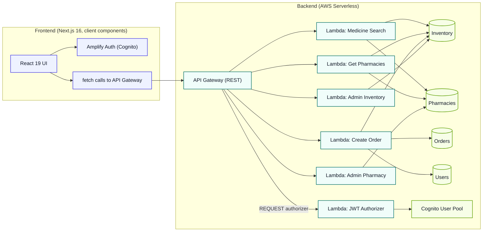

# MediFind - Medicine Finder

A serverless application for finding medicines at nearby pharmacies, built with **Next.js 16 (App Router)** and an **AWS serverless backend** (Lambda, API Gateway, DynamoDB, Cognito).

[](https://opensource.org/licenses/MIT)
[](https://nextjs.org/)
[](https://reactjs.org/)
[](https://aws.amazon.com/lambda/)
[](https://aws.amazon.com/dynamodb/)
[](https://aws.amazon.com/cognito/)

---

## Overview

MediFind connects patients with nearby pharmacies that have specific medications in stock. Users can search for medicines, see pharmacy availability, price, and stock level, and place an order. Admin users (via a `custom:role = admin` Cognito attribute) can manage pharmacies and inventory through the API directly - there is no admin UI yet.

## Architecture



Four separate DynamoDB tables (not a single-table design), each Lambda has its own least-privilege IAM policy, and the JWT authorizer is wired natively into API Gateway's `Auth.Authorizers` - it attaches the caller's `userId`/`email`/`role` to the request context so downstream functions never have to trust client-supplied identity. See `FIXES.md` for the full history of what was fixed to get here.

## Features

| Feature | Status |
|---|---|
| Medicine search (partial match, case-insensitive) | Working |
| Pharmacy listings with price, stock, distance | Working |
| Order placement (authenticated) | Working, with a stock race-condition guard |
| Email/password auth via Cognito (sign up, verify, sign in) | Working |
| Forgot / reset password | Not implemented |
| Token auto-refresh | Not implemented - tokens expire (Cognito default: 1 hour) and require re-login |
| Admin pharmacy/inventory management | Working, API-only - `custom:role = admin` required, no UI |
| Admin role assignment | No self-service or admin-facing path exists; must be set manually via AWS CLI (see `FIXES.md`) |
| Responsive design | Reasonable at common breakpoints; not formally audited |
| Infrastructure as Code | Full SAM template |
| Observability | Partial - CloudWatch Logs (30-day retention) and X-Ray tracing are on; 3 CloudWatch alarms exist but have no notification target configured (empty `AlarmActions`), so nothing alerts anyone when they fire |
| Automated tests | Backend only - 18 Jest tests across 3 of 6 Lambda functions. No frontend tests exist. |
| CI/CD | Not currently configured - no pipeline exists in this repo |

## Tech Stack

| Category | Technology | Notes |
|---|---|---|
| **Frontend** | Next.js (App Router) | 16.2.x, JavaScript (no TypeScript) |
| | React | 19.x |
| | Styling | Tailwind CSS v4 (CSS-first `@theme` config in `globals.css`) + Google Fonts via `<link>` tags |
| | UI Icons | Lucide React |
| | Auth | AWS Amplify JS (Cognito) |
| **Backend** | AWS Lambda (Node.js) | 22.x runtime |
| | API Gateway | REST API, native SAM `Auth.Authorizers` REQUEST authorizer |
| | Data Store | Amazon DynamoDB - 4 separate tables (Pharmacies, Inventory, Users, Orders), on-demand billing |
| | Auth | Amazon Cognito User Pools |
| | Infrastructure | AWS SAM (CloudFormation) |
| | Observability | Lambda Powertools (structured logging), X-Ray tracing, CloudWatch Logs |
| **Testing** | Jest | Backend only (`medicine-search`, `get-pharmacies`, `create-order`) |
| | ESLint | Both frontend and backend |

## Getting Started

### Prerequisites

- Node.js >= 20.x (Lambda runtime is 22.x; keep your local version close to that)
- Python >= 3.9 (for `seed_data.py`)
- AWS CLI v2, configured
- AWS SAM CLI
- Git

### Installation

```bash
git clone https://github.com/s-aduk/MediFind.git
cd MediFind

cd backend && npm install
cd ../frontend && npm install
```

### Environment configuration

The frontend needs 4 environment variables, all of which come from your deployed backend stack's outputs - there's nothing to configure until after your first deploy. See `frontend/.env.example`:

```bash
NEXT_PUBLIC_API_URL=https://<api-id>.execute-api.<region>.amazonaws.com/<stage>/
NEXT_PUBLIC_COGNITO_USER_POOL_ID=<region>_xxxxxxxxx
NEXT_PUBLIC_COGNITO_CLIENT_ID=xxxxxxxxxxxxxxxxxxxxxxxxxx
NEXT_PUBLIC_COGNITO_REGION=<region>
```

### Running locally

```bash
# Terminal 1: backend, deployed to AWS (no local Lambda emulation is set up)
cd infrastructure
sam build
sam deploy --guided     # first time only

# then seed sample data (see backend/seed_data.py) and set the frontend
# env vars above from your stack outputs

# Terminal 2: frontend
cd frontend
npm run dev              # http://localhost:3000
```

There's no `sam local start-api` workflow configured for this project (no `events/*.json` sample payloads exist) - the frontend talks to your real deployed API Gateway endpoint even during local frontend development.

### Deployment

See `MEDIFIND-LOCAL-DEPLOYMENT-GUIDE.md` for the full backend (SAM) + frontend hosting walkthrough.

## Project Structure

```
MediFind/
├── backend/
│   ├── src/functions/
│   │   ├── medicine-search/   # GET /search?q=<query>            (tested)
│   │   ├── get-pharmacies/    # GET /pharmacies/{medicineName}    (tested)
│   │   ├── create-order/      # POST /orders                     (tested)
│   │   ├── admin-inventory/   # ANY /admin/inventory              (no tests)
│   │   ├── admin-pharmacy/    # ANY /admin/pharmacies             (no tests)
│   │   └── jwt-authorizer/    # REQUEST authorizer                (no tests)
│   ├── package.json           # scripts: test, test:unit, lint, lint:fix
│   │                          # (test:integration is wired up but no integration/ dir exists yet)
│   └── seed_data.py           # populates DynamoDB with 10 sample medicines
├── frontend/
│   ├── src/
│   │   ├── app/
│   │   │   ├── page.js            # Landing page
│   │   │   ├── layout.js          # Root layout, loads globals.css + Google Fonts
│   │   │   ├── globals.css        # Tailwind v4 + design tokens
│   │   │   ├── search/page.js     # Search + order flow (client component)
│   │   │   └── login/page.js      # Sign in / sign up
│   │   ├── components/
│   │   │   ├── SearchMedicine.js  # Main search UI, wired into the search page
│   │   │   ├── PharmaciesList.js  # Alternate pharmacy-lookup UI - fixed, but not wired into any route
│   │   │   └── Login.js
│   │   └── lib/
│   │       ├── api.js             # Plain fetch wrapper - no retry/timeout/refresh logic
│   │       └── auth.js            # Amplify auth wrapper
│   ├── postcss.config.mjs         # Tailwind v4 PostCSS plugin
│   ├── package.json               # scripts: dev, build, start, lint (no test script)
│   └── .env.example
├── infrastructure/
│   └── template.yaml               # AWS SAM template - all resources
├── docs/
│   ├── adr/                        # Architecture decision records - audited and corrected to
│   │                                # match the actual implementation (see FIXES.md)
│   └── runbooks/                   # Deploy/rollback/seeding runbooks - audited and corrected
│                                    # to match the actual implementation (see FIXES.md)
├── MEDIFIND-LOCAL-DEPLOYMENT-GUIDE.md                        
├── LICENSE
└── CONTRIBUTING.md
```

## API Endpoints

All relative to the deployed API Gateway stage (default stage name: `prod`).

| Method | Path | Auth | Description |
|---|---|---|---|
| GET | `/search?q=<query>` | None | Search medicines, returns `{ count, items, searchTerm }` |
| GET | `/pharmacies/{medicineName}` | None | Pharmacies with that medicine in stock, returns `{ count, items }` |
| POST | `/orders` | JWT | Place an order. Body: `{ medicineName, pharmacyId, quantity }` |
| ANY | `/admin/pharmacies` | JWT, `custom:role=admin` | Pharmacy CRUD, routed internally by the Lambda based on HTTP method |
| ANY | `/admin/inventory` | JWT, `custom:role=admin` | Inventory CRUD, routed internally by the Lambda |
| POST | `/authorize` | None | Dead route - see [Known Issues](#known-issues) |

There is no `/health` endpoint, and no consistent response envelope - each function returns its own JSON shape (see `backend/src/functions/*/index.js`).

## DynamoDB Tables

Four separate tables, all on-demand (`PAY_PER_REQUEST`) billing by default:

| Table | PK | SK | GSIs |
|---|---|---|---|
| Pharmacies | `pharmacy_id` | - | `GSI_Name_Address` (name, address) |
| Inventory | `medicine_name` | `pharmacy_id` | `GSI_PharmacyId`, `GSI_MedicineName` |
| Users | `user_id` | - | `GSI_Email` (email) |
| Orders | `order_id` | - | `GSI_UserId` (user_id, created_at), `GSI_Status` (status, created_at) |

## Testing

```bash
# Backend
cd backend/src/functions/medicine-search && npm install && npm test
cd backend/src/functions/get-pharmacies && npm install && npm test
cd backend/src/functions/create-order && npm install && npm test
# admin-pharmacy, admin-inventory, jwt-authorizer have no tests

# Frontend - no test runner is configured
cd frontend && npm run lint   # only linting, no `npm test`
```

## Known Issues

- **CloudWatch alarms have no notification target.** `AlarmActions`/`OKActions` are empty on all 3 alarms - they'll show as "in alarm" in the console but nobody gets paged.
- **`/authorize` is a dead route** on `JwtAuthorizerFunction` - reachable (no auth required) but its handler returns an IAM policy object, not a valid API Gateway proxy response. Nothing in the frontend calls it.
- **No admin role assignment path exists.**
- **`frontend/src/app/page.module.css`** is a leftover, unused CSS Modules file from the original `create-next-app` scaffold - never imported anywhere. Safe to delete.

## License

MIT - see [`LICENSE`](LICENSE).

## Contributing

See [`CONTRIBUTING.md`](CONTRIBUTING.md).
